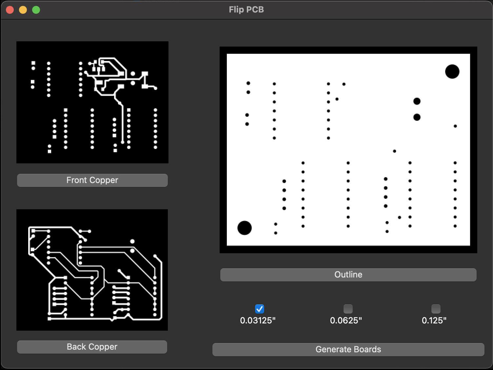
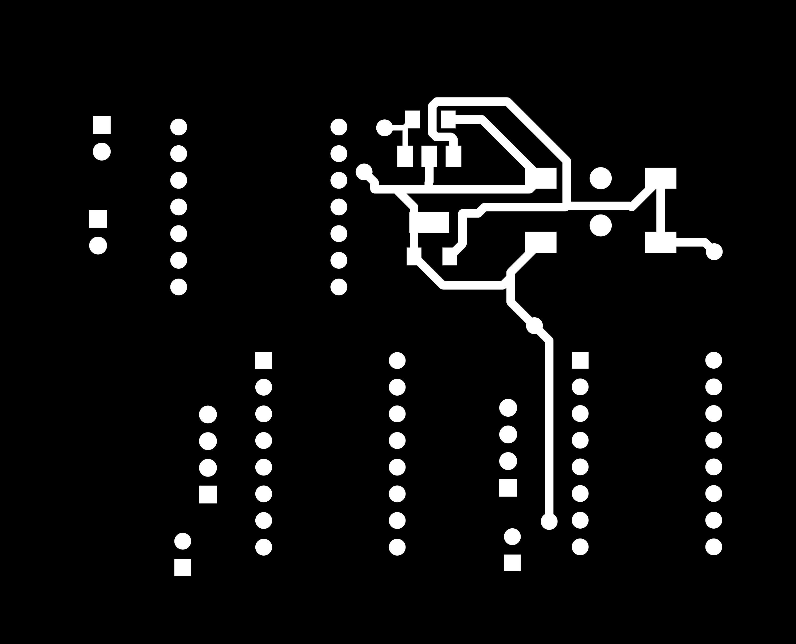
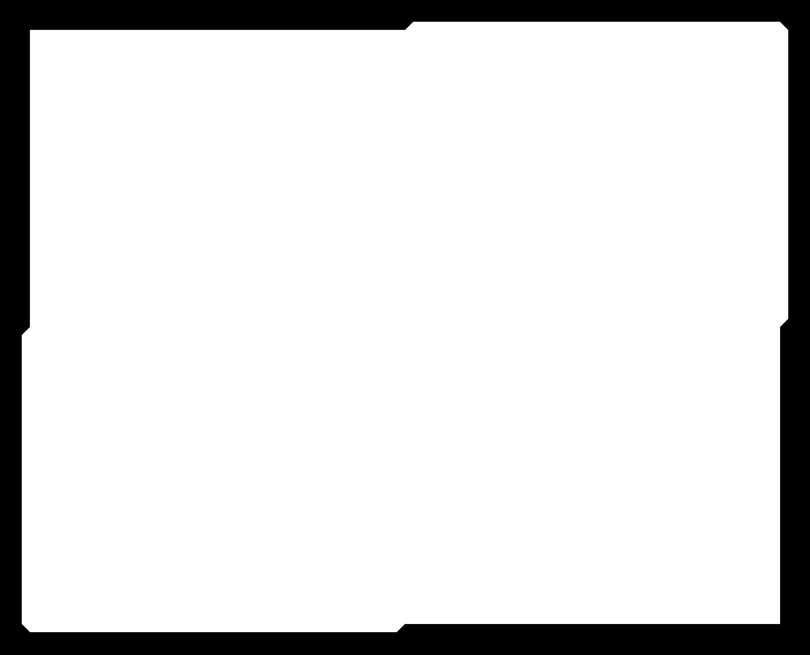
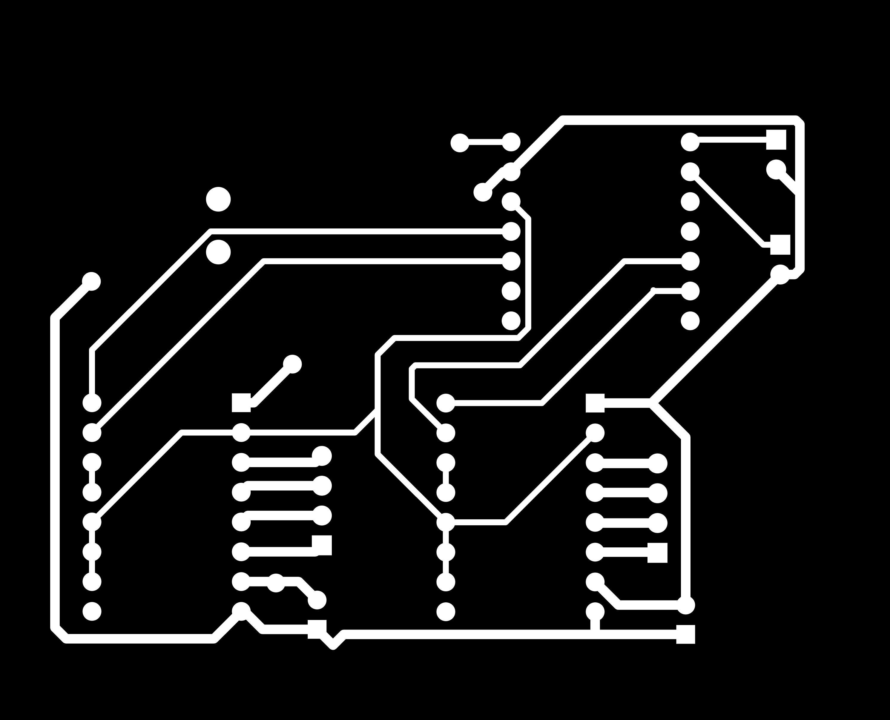
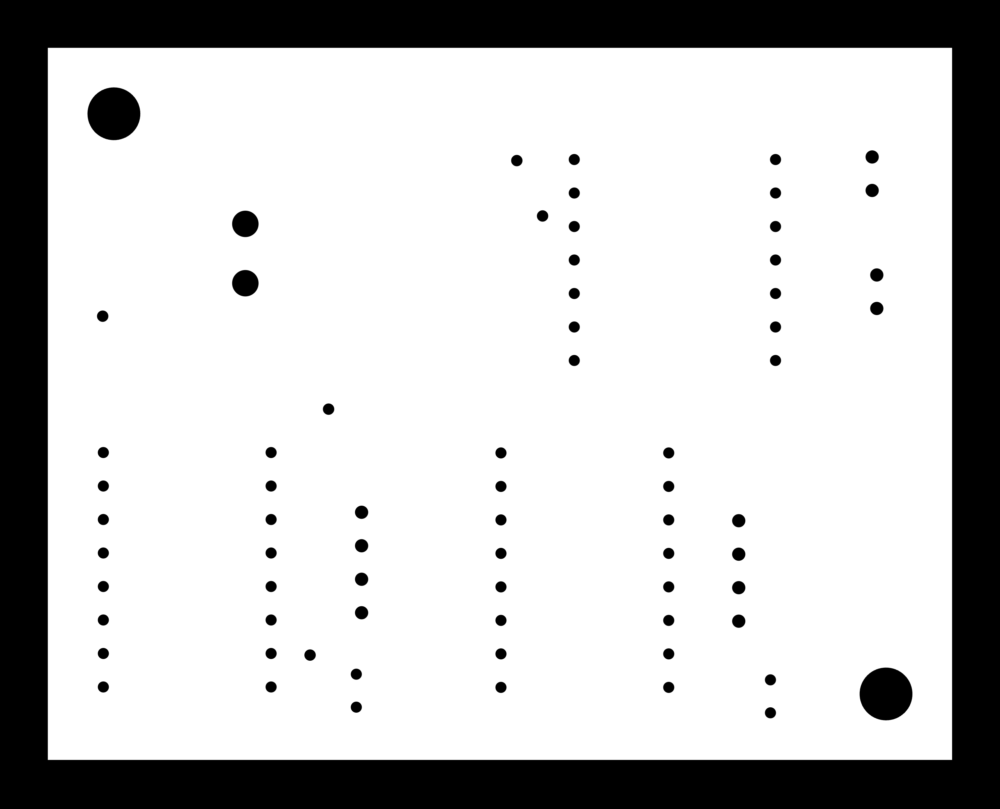
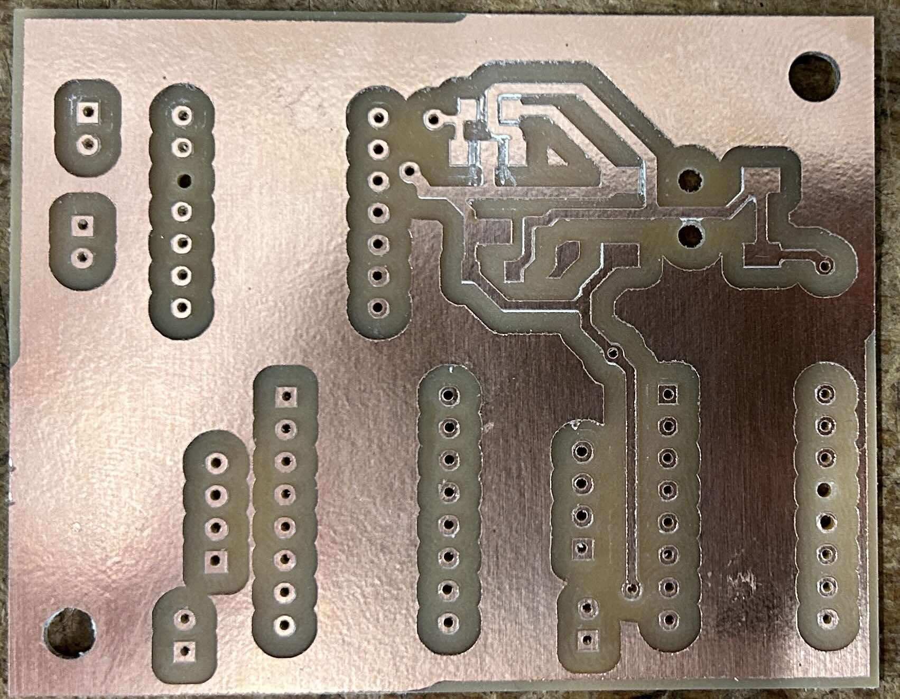
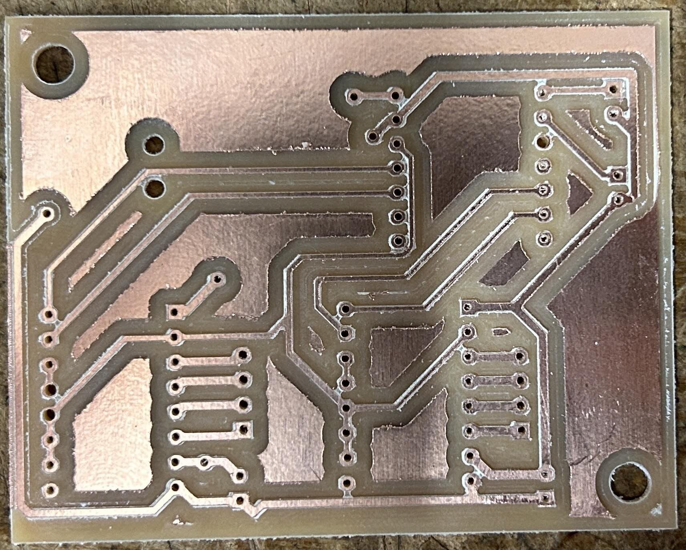

# Double Sided PCB Converter

## Turns your [gerber2img](https://quentinbolsee.pages.cba.mit.edu/gerber2img/) board images, and processes the images to allow for double sided pcb milling

Automating the process for milling double sided pcbs described [here](https://sibusaman.fabcloud.io/doublepcb/)


## How to Run 

Install the dependencies

```
pip install -r requirements.txt
```

Then run the app
```
python app.py 
```

Once the app is running click on the front copper, back copper, and outline buttons and select the corresponding images.
Then select the size end mill you are using to cut the outline (default is 1/32"). and click generate PCB

<div align = "center">
     
</div>

<p align = "center">
    The generated PCBs will be saved into your Downloads folder. The setup above would produce the example pngs below
</p>

<div align="center">

| front-copper.png | front-outline.png |
|------------------|-------------------|
|  |  |

</div>

<div align="center">

| back-copper.png | back-outline.png |
|-----------------|------------------|
|  |  |

</div>

## Finished Product

<p align = "center">
    This is what the above images look like when milled on an Roland SRM20 mill
</p>

<div align="center">

| Front Copper | Back Copper |
|-----------------|------------------|
|  |  |

</div>

